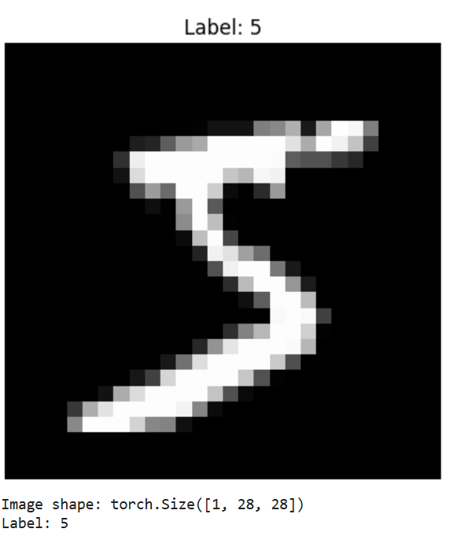
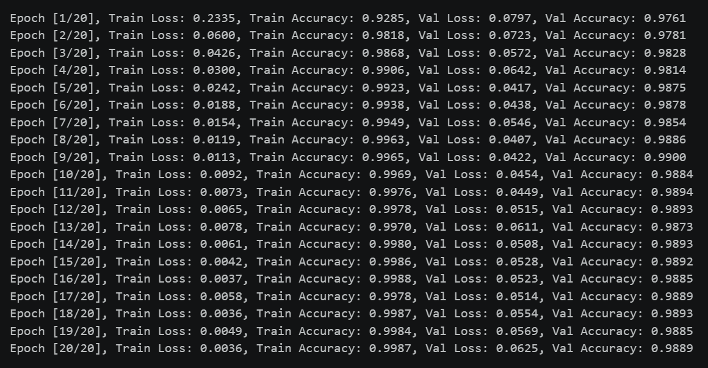
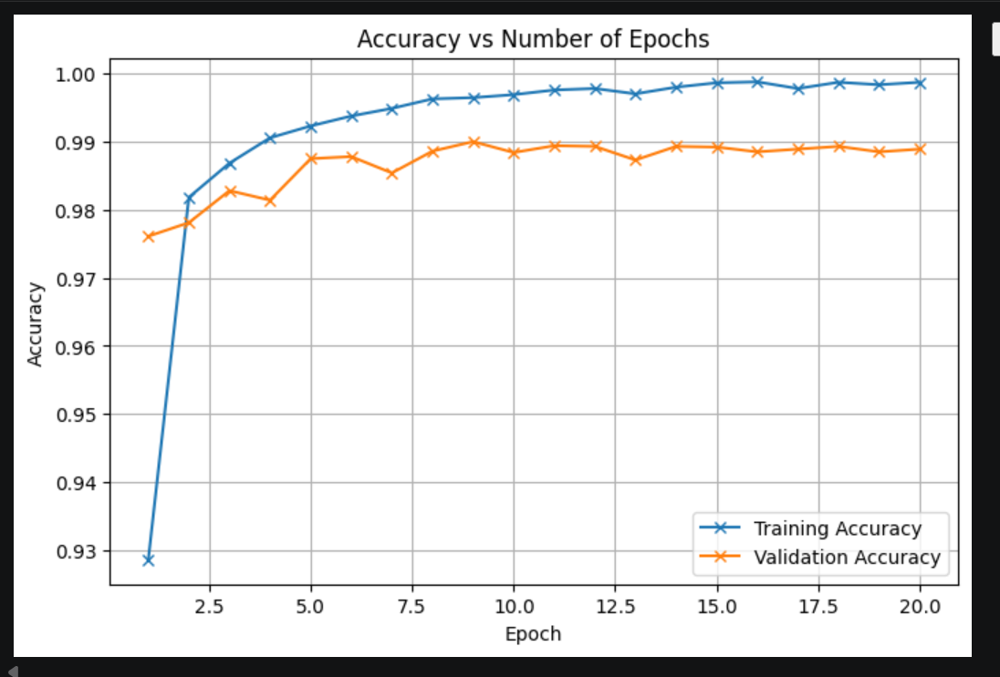
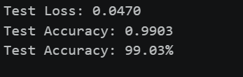

# 🖊️ Handwritten Character Recognition Using CNN

A deep learning project that uses a **Convolutional Neural Network (CNN)** to recognize handwritten digits from the **MNIST dataset**.

The project covers data loading, preprocessing, CNN model development, training, validation, evaluation, and saving the trained model using PyTorch.

---

## 📸 Project Preview

### MNIST Dataset Sample



### Training Process



### Training Results



### Final Result



---

## 📌 Project Overview

The objective of this project is to build a CNN-based image classification model that can recognize handwritten digits.

The model is trained using the **MNIST dataset**, where each image has a size of **28 × 28 pixels**.

The complete workflow includes:

- Loading the MNIST dataset
- Image preprocessing
- Building a CNN architecture
- Training the model
- Validating the model
- Evaluating test performance
- Saving the trained model

---

## 🎯 Objectives

- Understand image classification using CNNs
- Work with the MNIST handwritten digit dataset
- Build a CNN using PyTorch
- Train and validate the model
- Evaluate model performance
- Save the trained model for future use

---

## 📊 Dataset

The project uses the **MNIST handwritten digit dataset**.

Each image:

- Contains a handwritten digit from **0 to 9**
- Has a resolution of **28 × 28 pixels**
- Is represented as a grayscale image

Example:

```text
Image Shape: [1, 28, 28]
